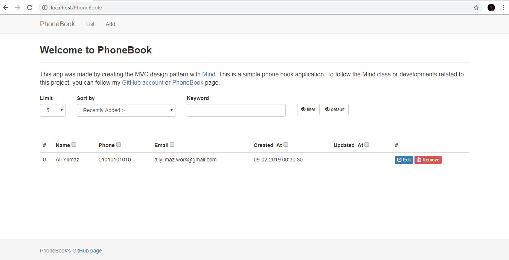
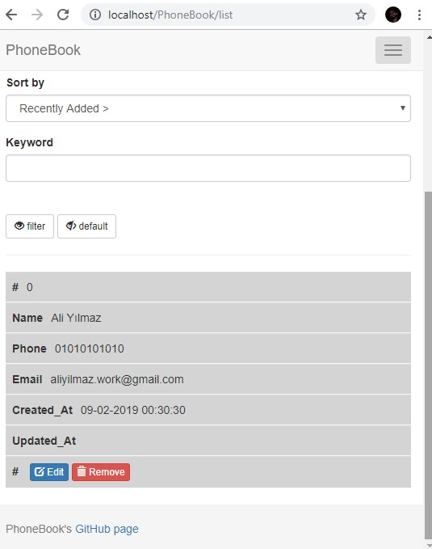
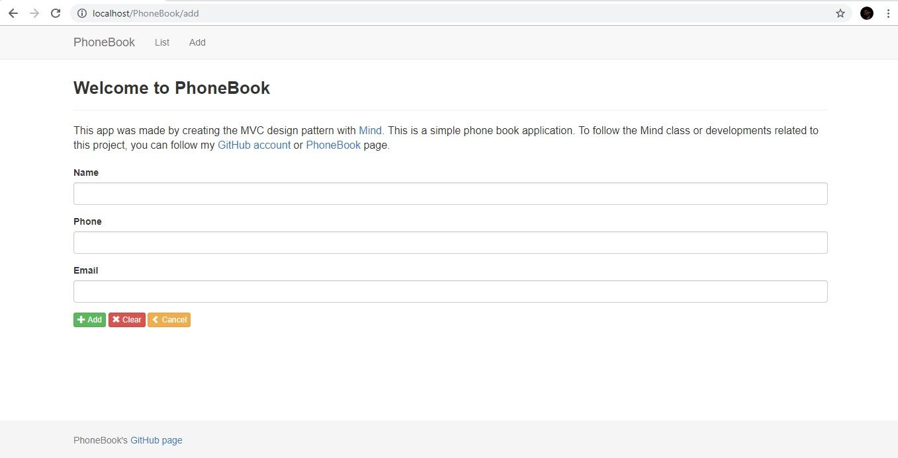
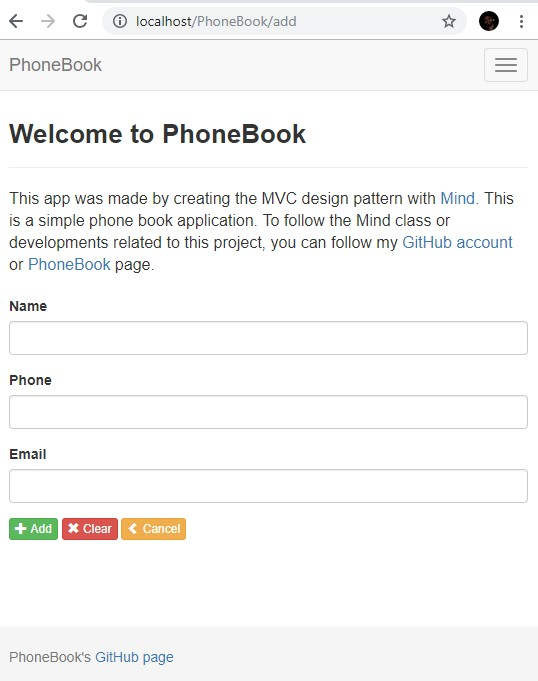
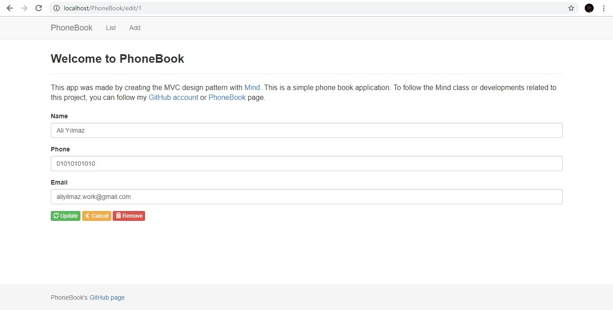
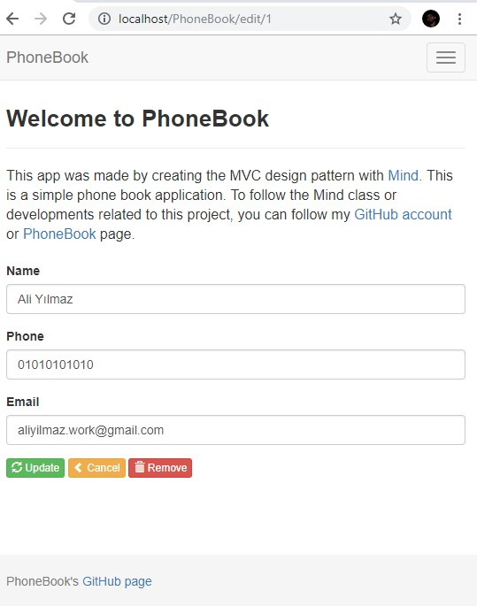
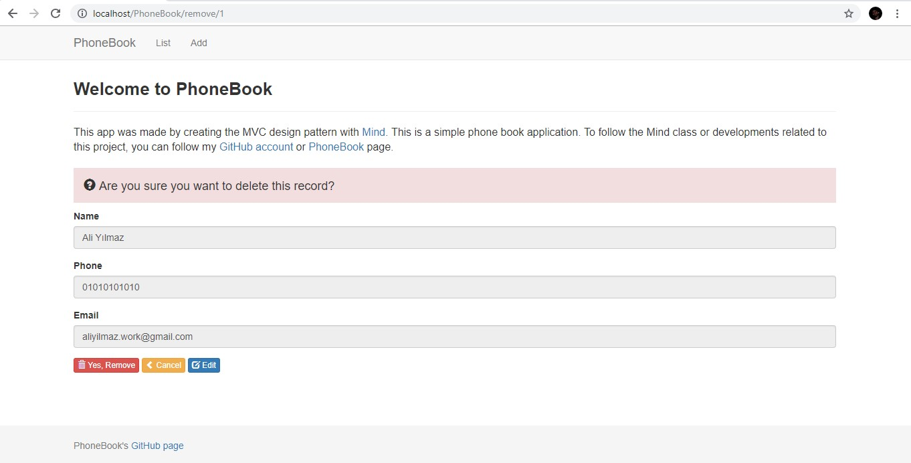
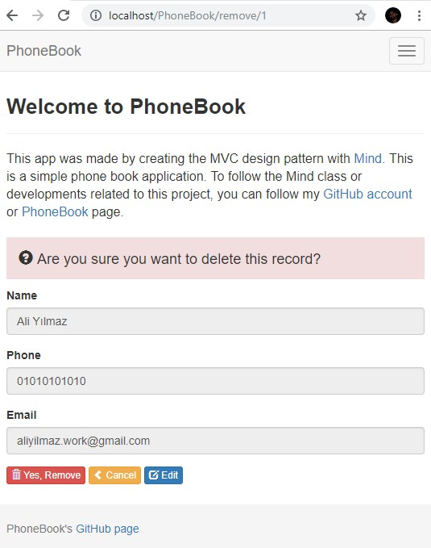
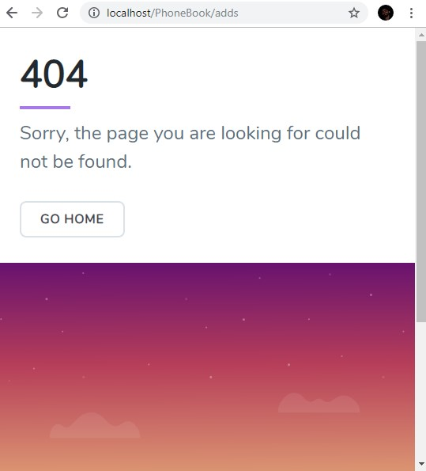

# PhoneBook

PhoneBook A simple phone book application.

## Screenshots

#### Main Page

##### Normal

##### Responsive

---

#### Add Page

##### Normal

##### Responsive

---

#### Edit Page

##### Normal

##### Responsive

---

#### Remove Page

##### Normal

##### Responsive

---

## Error Page

##### Normal

##### Responsive

